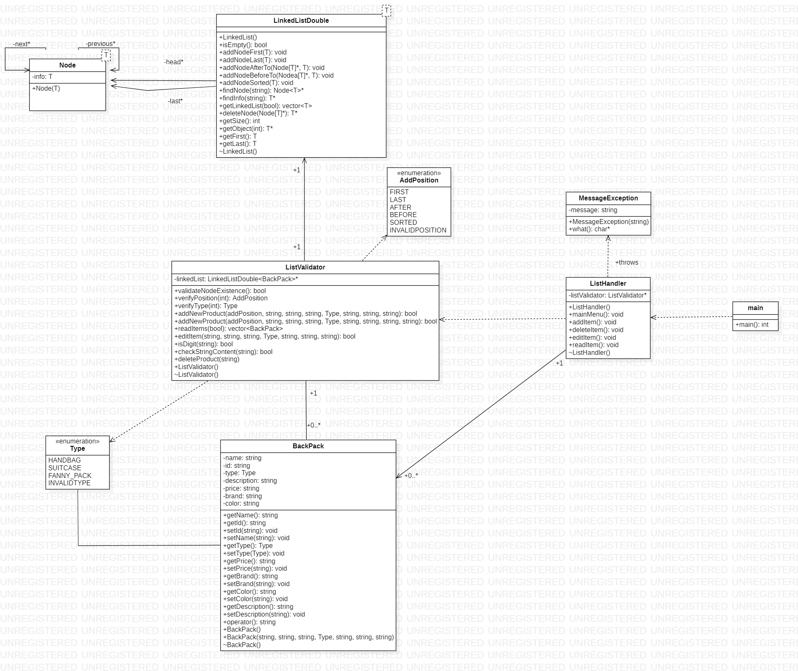

# Double-linked-lists
This is an example project of data structures, double linked list. In this project a BackPack type object is used to illustrate how the list works.

Submitted to engineer Jairo Riaño

UPTC💛🖤

## Class diagram
